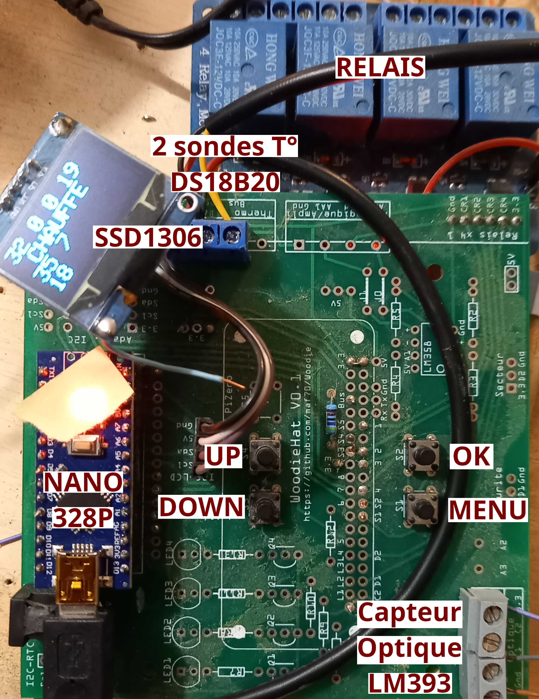
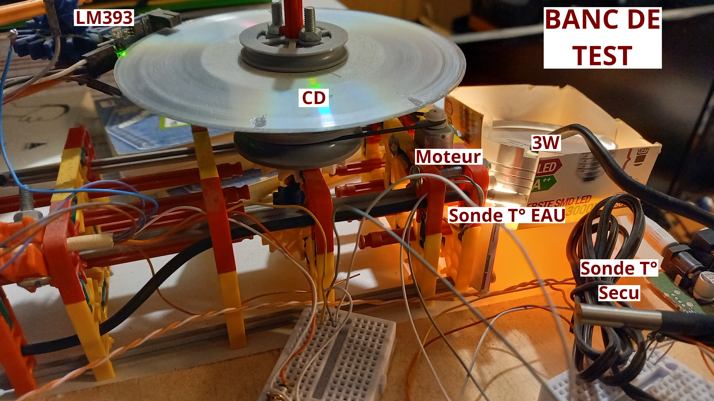
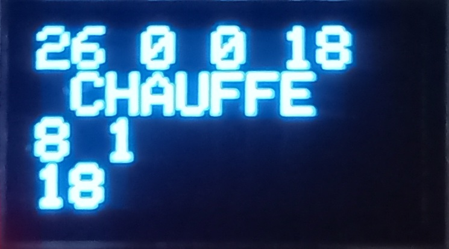
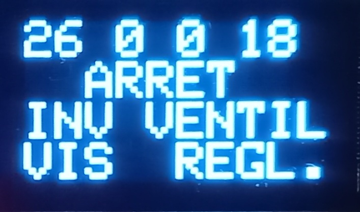
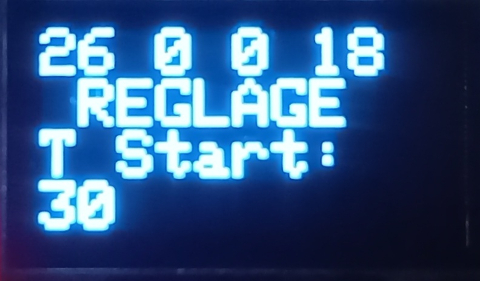
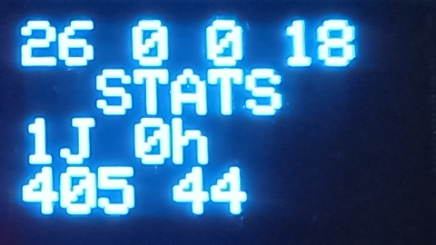
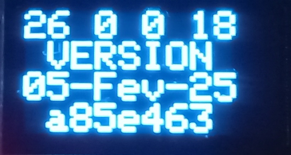
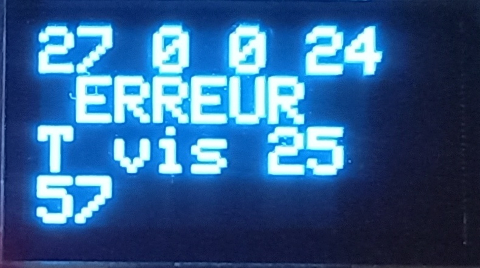

# Controleur de chaudiere à plaquette de bois

Ce controleur est une version low cost et plus robuste du projet woodie:
https://github.com/maf70/Woodie.git

Le meme pcb est reutilisé sans le PI zero.
Des connexions ont été rajoutées pour relier les capteurs/commandes entre le connecteur PI à 40 pins et les entrées/sorties du Nano (ATMega328P).

## Description 

La chaudiere se compose de:
- Un moteur entrainant une vis sans fin pour convoyer les plaquettes de la trémie vers le foyer.
- un opto-coupleur(s) (LM393) pour controler la rotation de la vis
- un moteur entrainant un ventilateur pour activer la combustion
- un capteur de temperature (DS18B20) de l'eau en sortie de chaudiere
- un capteur de temperature (DS18B20) de sécurité placé sur la vis.

Fonctionnement de la chaudiere:
- En debut de cycle (durée nominale 1 minutes), la vis et le ventilateur sont actionnés
- au bout de 10 secondes, la vis d'alimentation est arretée
- au bout de 50 minutes, le ventilateur est arreté
- au bout de 1 minute, le cycle recommence
- Si la temperature de l'eau est atteinte en fin de cycle, arret des cycles de chauffe
- Dès que la temperature redescend en dessous du seuil bas, redemarrage des cycles de chauffe
- Controle en permanance que les capteurs de temperatures sont toujours valides et que la temperature de securité n'est pas atteinte
- En cas de blocage de la vis, on arrete le moteur puis on le fait tourner en sens inverse pendant quelques secondes
- Verification que le moteur tourne en sens inverse

Securité / detections d'erreur
- Si la sonde de température sur la vis se declenche (seuil haut), on arrete pour éviter que le feu n'atteigne la trémie.
- Si la temperature de l'eau atteint un seuil bas, on arrete l'alimentation pour éviter de remplir le foyer car la chaudiere est probablement eteinte.
- si le nombre de blocage moteur atteint le max, on arrete egalement la chaudiere pour ne pas fatiguer le moteur.
- Si les 2 sondes de temperature ne sont pas correctement detectées (panne ou faux contact), on arrete également la chaudiere.

Le hardware du controleur de la chaudiere :

- un arduino NANO avec un 328P
- D'une carte 4 relais pour commander le moteur et son inversion, ainsi que le ventilateur
- D'un afficheur SSD1306 pour indiquer l'etat des capteurs et gerer les differents mode du controleur.
- De 4 boutons.

Pour les tests, un banc de test remplace la chaudiere :

- structure à base de jouet "Knex"
- un petit moteur 12V remplace le moteur de la vis
- celui-ci entraine un cd-rom sur lequel est positionné l'optocoupleur
- un spot à led (3 W) actionné par le relais du ventilateur simule la combustion activée par la ventilation.
- la sonde temperature de l'eau est positionné sous le spot
- la sonde securité mesure la temperature ambiante et peut etre placée sous le spot pour simuler un probleme.
- les consignes de temperatures sont adaptées en fonction du banc

## Mode d'emploi

### Mise sous tension:
- la chaudiere demarre toute seule si la temperature de l'eau n'est pas trop basse, ce qui veut dire qu'elle n'est probablement pas éteinte (cas d'une coupure de courant)
- La chaudiere se met en erreur si l'eau est trop froide. Une action manuelle doit etre effectuée pour démarrer la chaudiere.

### Affichage

Quel que soit l'état de la chaudiere:
- la premiere ligne indique toujours l'état des capteurs
- La deuxieme ligne indique le Menu courant ou l'état de la chaudiere ds le menu ON
- Les 3eme et 4eme lignes indiquent des information relatives au menu.

| Ligne| item 1 | item 2 | item 3 | item 4 |
|:--------|-------|--|--|--|
|1| Temperature EAU| Capteur Optique|Nb Blocage moteur/vis|Temperature VIS|
|2| Menu ou etat de la chaudiere||||
|3| Informations contextuelle||||
|4| Informations contextuelle||||

### Menu ON:

| Ligne| item 1 | item 2 | item 3 | item 4 |
|:--------|-------|--|--|--|
|1| Temperature EAU| Capteur Optique|Nb Blocage moteur/vis|Temperature VIS|
|2| Menu ou etat de la chaudiere: "DEMARRAGE / REPOS / CHAUFFE"||||
|3| Avancement du cycle|Nb de cycle en cours|||
|4| Nb de cycle de la chauffe precedente (si different de 0)|Temps entre les deux dernières chauffes (si different de 0)|||

Les états de la chaudiere:
- REPOS : Le seuil haut a été atteint, on arrete les cycles de chauffe.
- CHAUFFE : Le seuil bas a été atteint, on enchaine les cycle de chauffe
- DEMARRAGE : Le seuil de securité a été atteint, la premiere chauffe a été déclenchée manuellement

### Menu ARRET

Description:
| Ligne| item 1 | item 2 | item 3 | item 4 |
|:--------|-------|--|--|--|
|1| Temperature EAU| Capteur Optique|Nb Blocage moteur/vis|Temperature VIS|
|2| "ARRET"||||
|3| Label "inversion vis"|||Label "Ventilateur"|
|4| Label "vis"|||Label "Reglages"|  

Commandes:
| Bouton | Action|
|:--------|-------|
|UP| Demarrage moteur/vis en sens inverse|
|DOWN| Demarrage moteur/vis en sens normal|
|OK| Demarrage ventilateur|
|MENU| Menu suivant: REGLAGE|

### Menu REGLAGE

Ce menu permet de régler tous les parametres de fonctionnement de la chaudiere.
Les valeurs sont sauvegardées en EEPROM et récupérée à chaque mise sous tension.
Une vérification de la validité de la valeur est faite et si hors plage Min/Max, la valeur par defaut est utilisée.
Les plages des parametres sont compatibles avec la chaudiere et le banc de test.
Les valeurs par defaut sont compatibles avec la chaudiere.

Description:
| Ligne| item 1 | item 2 | item 3 | item 4 |
|:--------|-------|--|--|--|
|1| Temperature EAU| Capteur Optique|Nb Blocage moteur/vis|Temperature VIS|
|2| "REGLAGE"||||
|3| Label du parametre||||
|4| Valeur du parametre||||  

Commandes:
| Bouton | Action|
|--------|-------|
|UP| Incremente la valeur|
|DOWN| Decremente la valeur|
|OK| Valide et passe au reglage suivant|
|MENU| Menu suivant: STATS|

Liste des parametres:
| Label | Description|Min|Max|Defaut|
|--------|-------|-------|-------|-|
|T Start| Temperature (seuil bas) qui déclenche un cycle de chauffe|28|65|54|
|T Stop| Temperature (seuil haut) qui stoppe la chauffe|33|66|55|
|Cycle|Durée d'un cycle|30|254|60|
|Ventilo|Durée de la ventilation pendant le cycle|2|254|50|
|Moteur|Durée de fonctionement de la vis pendant le cycle |2|100|10|
|Invers.|Durée de fonctionnement du moteur en sens en cas de blocage|1|10|2|
|Compteur|Nombre minimum de detection otpique pour valider le fonctionnement du moteur|2|30|5|
|Blocages|Nb de blocage maximum avant arret de la chaudiere|1|15|3|
|T Secu|Temperature (seuil bas) indiquant un foyer eteint. Necessite une action manuelle pour redemarrer|25|50|27|
|T Vis|Temperature (seuil haut) indiquant que la chaleur se propage dans la vis d'alimentation en plaquettes. Necessite une action manuelle pour redemarrer |25|70|50|
|Sonde T|Affectation des sondes EAU / VIS|1|2|1|

### Menu STATS

Description:
| Ligne| item 1 | item 2 | item 3 | item 4 |
|:--------|-------|--|--|--|
|1| Temperature EAU| Capteur Optique|Nb Blocage moteur/vis|Temperature VIS|
|2| "STATS"||||
|3| Temps depuis la mise sous tension||||
|4| Nb total de cycle|Nb total de chauffe|||  

Commandes:
| Bouton | Action|
|--------|-------|
|UP| -|
|DOWN| -|
|OK| Relance la Chaudiere|
|MENU| Menu suivant: VERSION|

### Menu VERSION

Description:
| Ligne| item 1 | item 2 | item 3 | item 4 |
|:--------|-------|--|--|--|
|1| Temperature EAU| Capteur Optique|Nb Blocage moteur/vis|Temperature VIS|
|2| "VERSION"||||
|3| Date de la version en cours||||
|4| Commit|||  

Commandes:
| Bouton | Action|
|--------|-------|
|UP| -|
|DOWN| -|
|OK| Relance la Chaudiere|
|MENU| Menu suivant: STATS|

### Menu ERREUR

Description:
| Ligne| item 1 | item 2 | item 3 | item 4 |
|:--------|-------|--|--|--|
|1| Temperature EAU| Capteur Optique|Nb Blocage moteur/vis|Temperature VIS|
|2| "ERREUR"||||
|3| Label de l'erreur. Voir plus bas.|Valeur du parametre ayant declenché l'erreur|||
|4| Etat du compteur au moment de l'erreur|||

Commandes:
| Bouton | Action|
|--------|-------|
|UP| -|
|DOWN| -|
|OK| Relance la Chaudiere|
|MENU| Menu suivant: ARRET|

Liste des erreurs:
| Label | Description|Cause et depannage|
|--------|-------|-------|
|0 Sonde T| Aucune sonde de temperature detectée | Fonctionnement impossible. Verifier cablage et le serrage des connecteurs "Thermo"|
|1 Sonde T| Une seule sonde de temperature detectée| Fonctionnement impossible. Impossible de distinguer si sonde eau ou vis. Verifier cablage et le serrage des connecteurs "Thermo"|
|X Sonde T| Plus de 2 sondes de temperature detectée| Verifier cablage et le serrage des connecteurs "Thermo" |
|Moteur| La vis a atteint le nombre maximal de blocages| Debourrer et relancer|
|T eau | La temperature de l'eau a atteint le seuil bas.| Le foyer ne chauffe plus. Rallumer le feu et demarrer manuellement en appuyant sur "OK"|
|T vis | La temperature de la vis a atteint le seuil haut. | Danger d'incendie. Verifier la vis puis demarrer en appuyant sur "OK"|

